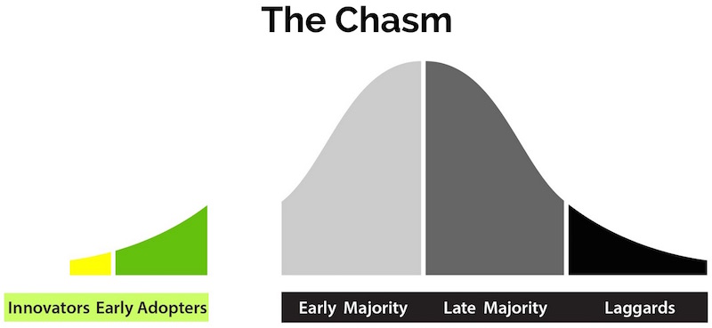

## {{ page.title }}

Models and strategies for driving adoption of automated testing throughout a
development culture.

- [Abandon Data and Absolute Reason](#abandon-data)
- [TDD Is Not for Everyone](#tdd-is-not-for-everyone)
- [Crossing the Chasm](#crossing-the-chasm)
- [The Chasm](#the-chasm)
- [“Poor Quality” Code Not an Issue](#poor-quality-not-an-issue)
- [Google’s Recipe](#googles-recipe)
- [Seize the Teachable Moments!](#seize-the-moment)
- [Play the Long Game](#play-the-long-game)

### Abandon Data and Absolute Reason

Unit testing is more about _avoiding_ visible impact than _producing_ it. Such
negative impact is practically [impossible to
prove](http://mike-bland.com/2012/07/10/test-mercenaries.html#mercs-proving-negatives).
Hence, when it comes to driving adoption of unit testing and automated testing
practices in general, experience is the most effective form of persuasion.

Given the distribution of the [diffusion of innovations
model](http://en.wikipedia.org/wiki/Diffusion_of_innovations), it is
inevitable that some will attempt to thwart your efforts to promote automated
testing by demanding data proving its effectiveness. Disregard those who
protest in this way; a demand for data proving the effectiveness of automated
testing is [cowardice masquerading as
reason](http://martinfowler.com/articles/testing-culture.html#change-stand).

Alternatively, turn the argument around: Ask for the data that conclusively
made the case for using programming language X, or text editor Y, or hosting
platform Z.

### TDD Is Not for Everyone

If writing the test first, all the time, works for you, great! But the literal
Test-Driven Development (TDD) approach is not for everyone.

The end result is well-tested code; TDD is not the only means to get there.
However, if you don’t do TDD, make sure you can break every test; if you
can’t, the test isn’t really doing what you think it’s doing.

### Crossing the Chasm

Geoffrey A. Moore’s book *[Crossing the
Chasm](http://en.wikipedia.org/wiki/Crossing_the_Chasm)* first explains the
different
segments of the Bell curve-shaped diffusion of innovations model:

 
_Image by Catherine Laplace based on other illustrations of the “Crossing the
Chasm” model._

- **Innovators and Early Adopters**: Partners-in-Crime; believe in principle;
  help each other clarify concepts, principles, priorities
- **Early Majority**: persuaded by results, reason, positive experience
- **Late Majority**: persuaded by common practice, lack of friction
- **Laggards**: abandon them; they are useless, dead weight

The Innovators and Early Adopters comprise the “Instigators”. It is their
responsibility to cross the “chasm” identified by Moore as the gap between the
Early Adopters and the Early Majority. Crossing the Chasm is what determines
the success or failure of an initiative, as crossing it is necessary to
achieve widespread adoption.

### The Chasm

When it comes to automated testing adoption, the “chasm” may be characterized
as:

- Slow and/or incorrect builds
- Ignorance of principles, techniques, and idioms
- Poor management and development culture

To this latter point, poor development culture is what prompted “[Finding More
Than One Worm in the Apple](http://queue.acm.org/detail.cfm?id=2620662)” and
“[Goto Fail, Heartbleed, and Unit Testing
Culture](http://martinfowler.com/articles/testing-culture.html)”.

The chasm is best crossed via persuasion, not force (laggards
notwithstanding). Albert Wong’s “Rainbow of Death” model from “[Large Scale
Development Culture Change: Google and the US
Government](https://18f.gsa.gov/2014/12/11/large-scale-development-culture-change/)”
describes a progression of activities Instigators must undertake to lead the
Early Majority across the chasm.

 
 
_Images by Catherine Laplace based on other illustrations of the “Crossing the
Chasm” model and Albert Wong’s framework image._

Fulfilling each step is necessary to producing lasting, positive change. By
moving from one step to the next (conceptually; in reality many efforts must
happen in parallel), the Early Majority is transformed from “Dependent” upon
the Instigators to “Independent”:

- **Intervene**: Instigators do the work
- **Validate**: Instigators validate the efforts of the Early Majority
- **Inform**: Instigators provide technical information and training to the
  Early Majority
- **Inspire**: Instigators motivate the Early Majority and help them feel that
  their work is valuable
- **Mentor**: Instigators build strong relationships with Early Majority
  members
- **Empower**: Early Majority members are able to do the work, with ongoing
  support from Instigators

### “Poor Quality” Code Not an Issue

“Poor quality” code is not part of the chasm. It is a symptom, not a cause.
Fix the build, spread ideas, and remove obstacles, and the code will improve.

### Google’s Recipe

The **Testing Grouplet** was a team of volunteers pooling their 20% time to
drive adoption of automated developer testing, in the most serious and fun
ways possible. Some of the more significant efforts included:

- **Test Certified**: a concrete roadmap towards sound automated testing.
- **Testing on the Toilet**: a weekly, one-page flyer published in restrooms
  company-wide to introduce testing concepts and tool developments. Started in
  2006 and still running today (January 2015), it proved a fantastic,
  distributed volunteer task. It started and standardized conversations, both
  inside and outside the Testing Grouplet, avoiding the echo chamber effect.
- **Test Mercenaries**: hands-on internal consultants that helped teams move
  up the Test Certified ladder. They also both informed internal tool
  development and drove company-wide tool adoption.
- **Fixits**: limited-time, all-out efforts to address “important but not
  urgent” tasks and roll out new tools. Fixits built momentum and morale, and
  the focused effort overcame huge obstacles, setting the stage for future
  developments.

This is how these efforts and a few others fit into the "Rainbow of Death"
model:

 
_Derived from Albert Wong’s original framework slide from a Google-internal
tech talk._

### Seize the Teachable Moments!

“goto fail” and Heartbleed were prime examples of why unit testing is so
critical. Both bugs were unit-testable, as proven by the working code in the
“[Finding More Than One Worm in the
Apple](http://queue.acm.org/detail.cfm?id=2620662)” and “[Goto Fail,
Heartbleed, and Unit Testing
Culture](http://martinfowler.com/articles/testing-culture.html)” articles.

When such opportunities to demonstrate the importance of unit testing arise,
we can seize the chance to publish articles, give presentations, and refer to
existing works. Such activities build a body of knowledge and give our
arguments scholarly weight.

When making our arguments, it’s important to emphasize “why” we unit test as
well as “how”. The “why” may be obvious to the Instigators who already “get
it”, but not necessarily to everyone.

### Play the Long Game

Lasting change never comes quickly. Eschew
_[authoritah](http://shop.southparkstudios.com/SOUTH-PARK-CARTMAN-POSTER-You-will/A/B00302A3OI.htm)_;
you know telling programmers “do as I say” is a recipe for disaster!

Understand that the problem isn’t purely technical, and it isn’t just about
testing: it’s about the “chasm”. Hearts and minds must be persuaded (Early
Majority), won (Late Majority), or conquered (laggards).
