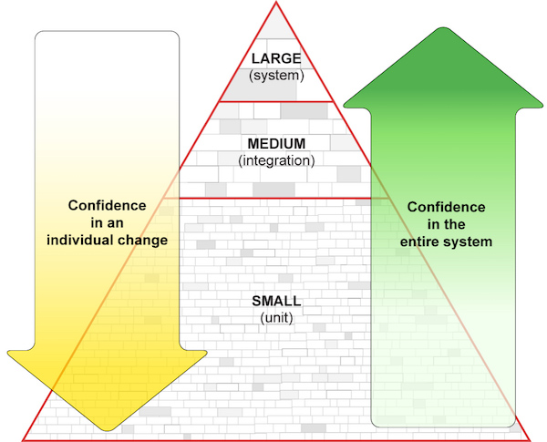

## {{ page.title }}

Fundamental automated testing and design concepts that inform the craft of
writing automated tests and testable code.

**WORK IN PROGRESS:** This material is currently in draft form and under
active development. See [the GitHub issues
page](https://github.com/18F/automated-testing-playbook/issues) to examine
progress.

- [Small, Medium, and Large Test Sizes: The Test Size Pyramid](#sml)
- [Strongly Prefer Composition over Implementation Inheritance](#composition)
- [Know the Difference Between Stubs, Mocks, and Fakes](#doubles)
- [Avoid Mocks](#avoid-mocks)
- [Prefer Fakes](#prefer-fakes)
- [Avoid Data-Driven Tests](#avoid-data-driven-tests)
- [Avoid Golden File Tests (Unless They Make Sense)](#avoid-golden-files)
- [Prefer Self-Contained Test Cases with Good Names](#self-contained-good-names)
- [Apply the Pseudo-xUnit Pattern If Necessary](#pseudo-xunit)
- [Well-Crafted Test Case Repetition Helps](#test-repetition)
- [Duplicate Code is a (Testing) Nightmare](#duplicate-code)

### Small, Medium, and Large Test Sizes: The Test Size Pyramid

 
_Illustration by Catherine Laplace, based on my hand-drawn sketch of a slide
from the Google Unit Testing Lecture slides, originally by Nick
Lesiecki_

An automated test can fall into one of [three broad
categories](https://mike-bland.com/2011/11/01/small-medium-large.html):

- **Small (Unit)**: Very fine-grained; exercises low-level logic at the scope
  of a function or a class; no external resources (except possibly a small
  data file or two, but preferably no file system dependencies whatsoever);
  very fast execution on the order of seconds
- **Medium (Integration)**: Exercises interaction between discrete components;
  may have file system dependencies or run multiple processes, including test
  databases; runs on the order of minutes
- **Large (System)**: Exercises the entire system, end-to-end; used to
  identify catastrophic errors and performance bottlenecks at scale; may
  launch or interact with live databases or services in a datacenter,
  preferably within a staging environment to avoid affecting production
  (especially user traffic, and most especially advertising traffic!); can run
  on the order of minutes or hours

The idea here is that you don’t want tests of only one size; different sizes
of tests serve very different purposes, but all sizes are vital to the health
of a project or system. More specifically:

- You want a lot of fast, focused small tests that you can run frequently to
  ensure that a low-level change is free of negative side-effects, without
  breaking the “flow” state while developing.
- You want a decent-sized layer of medium tests to ensure that contracts are
  honored at interface and component/subsystem boundaries.
- You want a few large tests to provide confidence that the end-to-end system
  is hanging together without any pieces falling off.
- For a production system or framework, you want a balance of all three, not
  relying on one size of tests alone. A team developing only pure, in-process,
  library code may get away without large tests, but most other projects should
  have them. Larger systems might even benefit from some “enormous” tests and/or
  a staging system mirroring production, possibly requiring manual intervention
  and monitoring.

The goal is to __automate at the lowest level possible, but no lower__. Shoot
for an appropriate balance, not an ideal one. There will always be a need for
manual testing; the point is to get the most out of it, not to eliminate it.

References:

- [Small, Medium, Large](https://mike-bland.com/2011/11/01/small-medium-large.html)
- [Small, Medium and Large Test Sizes](http://autotestcentral.com/small-medium-and-large-test-sizes)

### Strongly Prefer Composition over Inheritance

Testability begins with design. Reuse classes via composition rather than inheritance whenever possible.

Composition-based design produces classes that can be tested more efficiently and vigorously, and are easier to reuse across otherwise unrelated classes. Classes composed of smaller objects are also easier to isolate and test (using [fakes, mocks, and stubs](#doubles), if necessary), and can more easily grow and change by adding, removing, or replacing internal objects. The increased modularity and testability of composed classes is often worth the cost of the extra code required to delegate method calls to internal objects.

Inheriting from a class to reuse its implementation often introduces dependencies that are hard to replace, and can hide behavior. Tests for derived classes with non-obvious behaviors and heavyweight dependencies are often complicated, brittle, slow, and/or nondeterministic (i.e. “flaky”).

On the other hand, in statically-typed languages (e.g. C++, Java), interface-only inheritance enables an object to be replaced with any other object of the same interface. Classes can then be composed of references to interface classes, rather than instances of concrete classes (i.e. dependency injection). Tests can use these interfaces to define fakes, mocks, or stubs that replace heavyweight or complicated dependencies and provide better control of the code under test. In dynamically-typed languages (e.g. Python, Ruby, Javascript), interface inheritance is unnecessary, since the language runtime will raise an exception when the interface contracted is violated.

If you are using a framework that requires you to inherit implementation from classes in order to hook into it (e.g. Jekyll), you can still implement your derived classes in a compositional style. In this way, you can isolate and test most of the behavior specific to your application without having to set up and manage the framework's dependencies and configuration. For an example, see the `_plugins` and `_test` directories of the [18F Hub](https://github.com/18F/hub). Though [Hub::Generator](https://github.com/18F/hub/blob/master/_plugins/hub.rb) derives from `Jekyll::Generator`, all of its behaviors are encapsulated in other classes, which are tested in isolation.

References:
- [Max Three Layers Of Inheritance from the c2 wiki](http://c2.com/cgi/wiki?MaxThreeLayersOfInheritance)
- ["When to Use Inheritance or Composition" from _Learn Python the Hard Way_](http://learnpythonthehardway.org/book/ex44.html#when-to-use-inheritance-or-composition)

### Know the Difference Between Stubs, Mocks, and Fakes

Not all objects that stand in for “real” classes are __mock__ objects.
Generally known as “test doubles”, stubs, mocks, and fakes all serve to
isolate the code under test from a more complex and/or heavyweight
collaborator.

**Stubs** contain no logic, are manually written without the aid of frameworks
or other tools, and only return data assigned by the test code. These are
useful when interaction with a collaborator is relatively straightforward.

**Mock objects** are written using __mock object frameworks__, and are
programmed to expect certain method calls by the code under test, and to
return specific values as a result of such calls. They are more versatile than
stubs, and can verify more complex interactions, but can grow needlessly
complex without careful tending.

**Fakes** are fully-functional, yet smaller-scale implementations of real
collaborators. They are manually maintained rather than framework-generated.
They may be initialized with test data and/or examined for state changes after
the code under test has completed execution. Otherwise, specific interactions
are not validated, as they often are in the case of mocks.

References:

- [Testing on the Toilet: Know Your Test
  Doubles](http://googletesting.blogspot.com/2013/07/testing-on-toilet-know-your-test-doubles.html)

### Avoid Mocks

Mocks should stand in for expensive and/or complex __immediate
collaborators__. Use mock object frameworks when you __have__ to; overuse of
mocks fosters brittleness.

When mock objects are programmed __to return other mock objects__, that is
often a design smell, i.e. indicative that there is something amiss with the
design.

Prefer using real, stub or fake objects instead, using data packaged as a
hermetic (i.e. version-controlled) dependency of the test program.

### Prefer Fakes

For sufficiently complex and/or heavyweight collaborators, fakes can be far
preferable to mocks. They can be far easier to setup and maintain, despite the
fact that they may need their own automated tests. Despite the extra work
involved, a well-tested fake implementation may prove to be an investment that
pays off very well over time.

Ideally, the maintainer of the original code/service will provide a fake
implementation clients can use to test against, as the maintainer will be in
the best position to ensure the relevant feature parity between
implementations. When that isn’t the case, as a client of a complex service,
you may begin writing your own fake implementation, starting out small and
building out the implementation as needed.

Case in point: [Pyfakefs](http://code.google.com/p/pyfakefs), which is now
available in the [Python Package
Index](https://pypi.python.org/pypi/pyfakefs), started as a Google-internal,
personal tool to fake out Python’s builtin file system interface for a single
set of automated tests. Since its announcement in [Testing on the
Toilet](https://mike-bland.com/2011/10/25/testing-on-the-toilet.html) in 2006,
it’s now used in over 2000 automated tests at Google as of July 2014.

### Avoid Data-Driven Tests

A “data-driven” test is characterized by single test function which is used to
iterate through an array of data structures. Each element of the array
contains both the input data and the expected output values.

Sometimes the interface to a method is so stable and uncomplicated that a
data-driven structure is the easiest and most straightforward to understand.
More often than that, however, data-driven tests require the programmer to
remember the structure of the test data and the semantics of individual values
within the structure. For example, how would one interpret a structure such as
`{ true, 1, 0, false, “foo” }`? What do `true` and `false`, `0` and `1` mean
in this context?

Also, when a new test case requires a new piece of data, then all of the
existing structures must be updated, increasing the maintenance burden and the
mental burden of understanding each value in the structure.

By contrast, a well-defined test fixture can facilitate easy to read, easy to
maintain, easy to extend, self-contained test cases. A common `init()`
function (or an Xunit-style `setUp()`, or what-have-you) can encapsulate the
addition of a new test input by setting a default value. Only the tests making
use of the new input will need to be modified, rather than having to add
otherwise meaningless data to many data-driven test fixtures.

### Avoid Golden File Tests (Unless They Make Sense)

A “golden file” is a log of output from a previous run of a test program. It
is expected that subsequent runs should produce no differences in output. If
there are differences, the programmer must decide if a defect has occurred or
if the golden file must be updated. As such, they can be very brittle when
exercising broad swaths of program behavior.

That said, there are a few situations in which golden files make sense:

- If there are no other tests for much of a program’s code, a golden file is a
  way to pin down behavior while refactoring to add new automated tests.
- If a program has good automated test coverage by other means, a golden file
  can act as a “large” test and/or a smoke test.
- If a program integrates a lot of frequently-updated components not produced
  by the team itself, a golden file test can serve to notify the team that
  integrated features have been significantly updated. The team can then
  notify the component team to determine whether or not the delta is
  acceptable. If it is, the golden file can be updated. If it’s not, the
  component team can fix or roll back the change.

### Prefer Self-Contained Test Cases with Good Names

A “self-contained” test means that the test case includes (almost) everything
necessary to understand the test _without having to read any surrounding
code_.

The first step is picking a good name for the test that clearly signifies its
intent. The second step is to use test fixtures and/or helper classes to
provide common data and helper functions, greatly simplifying and clarifying
the steps taken by each test case.

References:

- [Testing on the Toilet: Writing Descriptive Test
  Names](http://googletesting.blogspot.com/2014/10/testing-on-toilet-writing-descriptive.html)
- [Testing on the Toilet: What Makes a Good
  Test?](http://googletesting.blogspot.com/2014/03/testing-on-toilet-what-makes-good-test.html)

### Apply the Pseudo-xUnit Pattern If Necessary

While many languages now include testing libraries that follow the
[xUnit](http://martinfowler.com/bliki/Xunit.html) style, it’s possible to
approximate the xUnit style very effectively without importing a special
framework by following [the pseudo xUnit
pattern](https://mike-bland.com/2014/06/05/pseudo-xunit-pattern.html).

### Well-Crafted Test Case Repetition Helps

When a test fails, you want to know what’s different about it. Repetition in
test case structure makes the significant differences between test cases stand
out.

### Duplicate Code is a (Testing) Nightmare

By contrast, implementation code that’s been copied-and-pasted is [prime
breeding ground for catastrophic
bugs](http://queue.acm.org/detail.cfm?id=2620662). Automated testing exerts
design pressure that favors common functions thoroughly tested in isolation
over copied-and-modified code that may not be adequately covered by tests.
